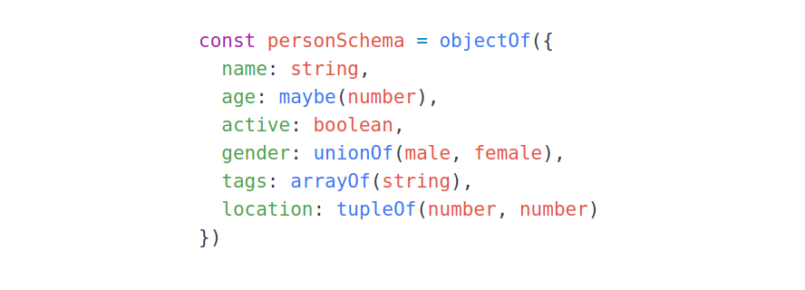

# flow-typer

> Declarative static and runtime type checking with Flow.

[](https://www.npmjs.com/package/flow-typer-js)
[](https://travis-ci.org/gmazovec/flow-typer)
[](https://codeclimate.com/github/gmazovec/flow-typer/test_coverage)

So you are using [Flow](https://flow.org) to type check your code. That's great but how do you
check types for data that is not known before running the code? Like _JSON_ input.
Sure, you can use your favorite validation library and do unsafe type casting. Or
you write verbose code and do low-level type checking with _typeof_ operator to
satisfy _Flow_'s refinement.

_flow-typer_ is solving these problems by writing maintainable type schemas in
_JavaScript_ with _Flow_ interoperability.



### Features

- support for primitive and complex Flow types
- complete _Flow_ coverage
- type functions are immutable
- define _Flow_ types with JavaScript
- no transpilation required
- works with ES6 JavaScript (modern browsers and Node 6+)


## Installation

```shell
npm install --save flow-typer-js
```


## Importing

```javascript
import typer from 'flow-typer-js' // ES6
var typer = require('flow-typer-js') // ES5 with npm
```


## Usage

_flow-typer_ exposes a set of functions for type checking at runtime. These
functions are constructed in way that allows _Flow_ to infer types and keep
refinement of the code. By composing functions, we define a type schema that
can be used to create inferred _Flow_ types (static checking) and for validating
values with unknown type at runtime.

```javascript
import {
  typeOf,
  objectOf,
  arrayOf,
  tupleOf,
  unionOf,
  literalOf,
  string,
  number,
  boolean,
  maybe
} from 'flow-typer-js'
```

```javascript
// literal types require Flow annotation
const male$Literal = (literalOf('male'): $Literal<'male'>)
const female$Literal = (literalOf('female'): $Literal<'female'>)
```

```javascript
// define type schema
const personSchema = objectOf({
  name: string,
  age: maybe(number),
  active: boolean,
  gender: unionOf(male$Literal, female$Literal),
  tags: arrayOf(string),
  location: tupleOf(number, number)
})
```

```javascript
// infer Flow type to JS variable from schema
const personType = typeOf(personSchema)
```

```javascript
// define Flow type from JS variable
type PersonType = typeof personType
```

```javascript
// check value of unknown type against type schema
const person = personSchema(unknownInput)
```

```javascript
// type schema returns value of specific type
person.name.toUpperCase() // No error
person.email // Flow error (unknown attribute)
person.active = 1 // Flow error (boolean value expected)

```

## Errors

Type validation throws `TypeValidatorError` which contains useful information
about why validation failed and what kind of type is expected.

```
TypeValidatorError: invalid "string" value type; "array" type expected
    ...

    scope    PackageT.dependencies
    expected Array<{"name":"string","version":"string"}>
    type     string
    value    "flow-typer"
    file     .../flow-typer-examples/index.js:15:15

```

- _scope_ - level at which validation failed
- _expected_ - the expected type of input value
- _type_ - the actual type of input value
- _value_ - input value in JSON format
- _file_ - file with position where the validator was called


## API

These functions will check for specific JavaScript type with correct _Flow_ type
refinement.

- `typer.isNil`
- `typer.isUndef`
- `typer.isBoolean`
- `typer.isNumber`
- `typer.isString`
- `typer.isObject`

### Primitive types

- `typer.nil`
- `typer.undef`
- `typer.boolean`
- `typer.number`
- `typer.string`
- `typer.literalOf(value)` (requires _Flow_ annotations \*)

```javascript
const flow$Literal = (literalOf('flow'): $Literal<'flow'>) // => type T = 'flow'
```

### Complex types

- `typer.mixed`
- `typer.object`
- `typer.maybe(schema)`
- `typer.objectOf(schemaObject, label)`
- `typer.arrayOf(schema, label)`

```javascript
const schema = arrayOf(number) // => type T = number[]
```

- `typer.tupleOf(...schema[])`

```javascript
const schema = tupleOf(string, number) // => type T = [string, number]
```

- `typer.unionOf(...schema[])`

```javascript
const schema = unionOf('week', 'month') // => type T = 'week' | 'month'
```


### Utilities

- `typer.isType(schema)`
- `typer.typeOf(schema)`

```javascript
const schema = arrayOf(userSchema)
const userListT = typeOf(schema)

// flow
type UserListT = typeof userListT
```

- `typer.getType(schema)`

```javascript
const schema = objectOf({
  dependencies: arrayOf(objectOf(
    name: string,
    version: number,
    exact: boolean
  ))
})

getType(schema)
// => { dependencies: Array<{ name: string, version: number, exact: boolean }> }
```

### Errors

- `TypeValidatorError`
  - `expectedType: string`
  - `valueType: string`
  - `value: string`
  - `typeScope: string`
  - `sourceFile: string`

## TODO

- Improve error messages for runtime validation.

- Use `literalOf` and `tupleOf` without explicit _Flow_ type annotations. Literal
and tuple types can not be inferred by _Flow_. This could be solved with new
Flow utility types `$Literal` and `$Tuple`.
